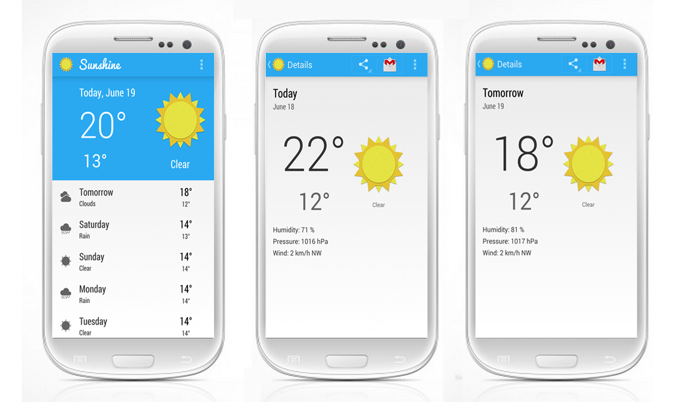

# sunshine
A weather app for Android using data from the OpenWeatherMap API.

(Based on Google's Udacity course [Developing Android Apps: Android Fundamentals](https://www.udacity.com/course/ud853))